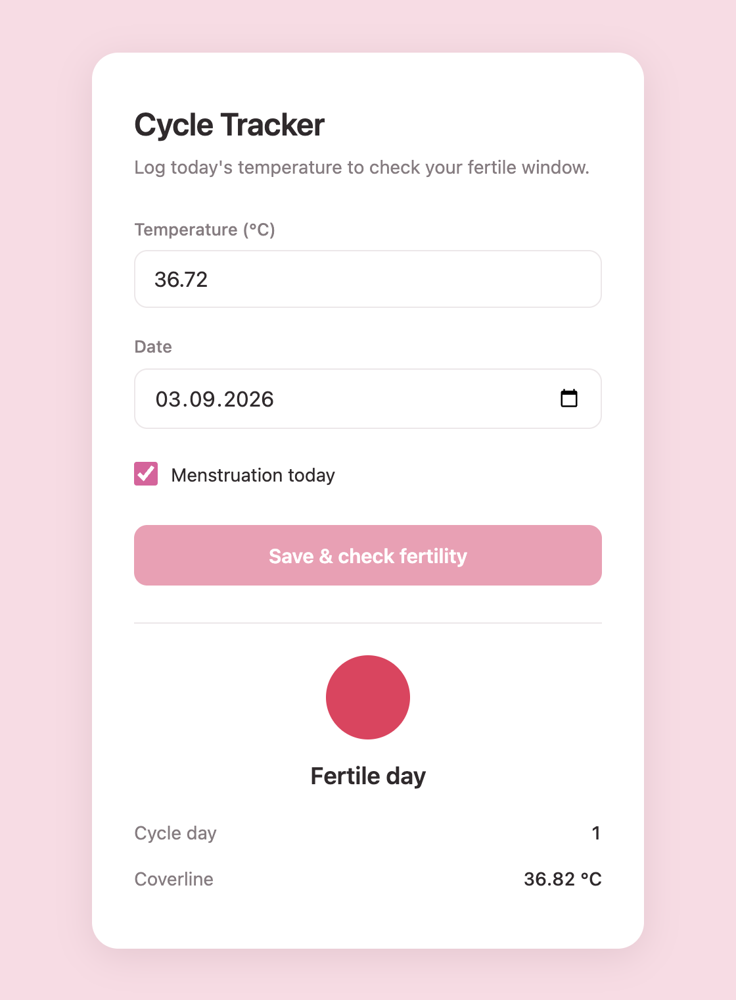

# Cycle Tracker

A small menstrual cycle tracker that estimates your fertile window from daily
basal body temperature, using the symptothermal coverline method.

Log a temperature for the day and it tells you whether you're still in the
fertile window, which cycle day you're on, and where the coverline sits.



## How it works

The model in [`src/model.py`](src/model.py) follows the standard coverline rule:

1. **Coverline** — the median temperature of the first 10 days of the cycle
   (the follicular phase), plus a 0.1 °C margin.
2. **Ovulation confirmed** — the first day with three consecutive temperatures
   above the coverline. This is the classic three-over-six rule.
3. **Fertile window** — every day up to and including the confirmation day is
   marked fertile. Days after it are not. Until ovulation is confirmed, the
   cycle is treated as fertile throughout.

Cycles are split on the first day of menstruation, and gaps in temperature
readings are linearly interpolated.

> This is a personal side project, not a medical device. Don't use it as
> contraception.

## Running it

```bash
python -m venv venv
source venv/bin/activate
pip install -r requirements.txt

cp .env.example .env    # optional: point CYCLE_DATA_PATH at your own export
./start.sh
```

`start.sh` launches the Flask API on port 5001 and opens the frontend. The
frontend expects to be served from port 5500 (that's what the API allows via
CORS), e.g. with VS Code Live Server or:

```bash
python -m http.server 5500
# then open http://127.0.0.1:5500/frontend/index.html
```

### API

| Method | Route | Purpose |
|---|---|---|
| `GET` | `/api/status` | Health check |
| `POST` | `/api/predict` | Fertility status for the current cycle |
| `POST` | `/api/log` | Append one day's entry to the dataset |

Note that `/api/log` writes back to whatever `CYCLE_DATA_PATH` points at.

## Data and privacy

This repo contains **no real cycle data**, and it should stay that way.

- `data/synthetic/` — generated sample data, safe to commit. This is the
  default the app runs on, and what the screenshot above shows.
- `data/raw/` and `data/processed/` — your real exports. Gitignored.
- Real data paths live in `.env`, which is gitignored. See `.env.example`.
- Notebooks are committed **without outputs**, since outputs embed the data
  they were run on.

A pre-commit hook enforces the last two points. Enable it after cloning:

```bash
git config core.hooksPath .githooks
```

It blocks commits containing notebook outputs, files under `data/raw/`,
absolute home-directory paths, or anything secret-shaped.

## Layout

```
app/         Flask API
src/         Coverline model
frontend/    Static HTML/CSS/JS client
data/
  synthetic/   Generated sample data (committed)
  raw/         Real exports (gitignored)
  notebooks/   Exploratory analysis
```
